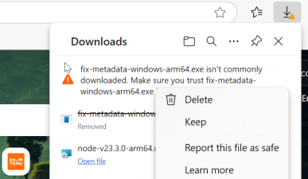

# metadata-fix

## Overview
`metadata-fix` is a tool to read and modify metadata of image and video files based on their filenames.


### When is it useful?
Any time you move media from a device to another you could lose data information. Those are useful if you want to sort files by date. In order to solve the issue , this tool inspects the filename for finding information about the date and change the metadata accordingly. 

### Parsed filenames
The tool parses the following filenames:
- `IMG_YYYYMMDD_HHMMSS.jpg`
- `VID_YYYYMMDD_HHMMSS.mp4`
- `YYYY-MM-DD_HH-MM-SS.jpg`
- `YYYY-MM-DD_HH-MM-SS.mp4`
- `YYYYMMDD_HHMMSS.jpg`
- `YYYYMMDD_HHMMSS.mp4`
- `IMG-YYYYMMDD-WA0000.jpg`
- `VID-YYYYMMDD-WA0000.mp4`
- `IMG-YYYYMMDD-WA0000.jpeg`
- `VID-YYYYMMDD-WA0000.mov`

### Allowed extensions
The tool supports the following extensions:
* jpg
* jpeg
* png
* gif
* bmp
* tiff
* heic
* heif
* webp
* mp4
* mov
* avi
* mkv
* mp3
* wav
* flac
* pdf
* docx


## Usage
To use `metadata-fix`, run the following command:

```sh
metadata-fix <folder-path> [--override]
```

- `<folder-path>`: The path to the folder containing the images and videos.
- `--override`: Optional flag to override existing files. If not set, new files are created by appending `--modified` to the file name.

### Example


## Installation
You can download the latest release from the [Releases](https://github.com/giper45/metadata-fix/releases) page.

### Windows Security
When download the file, your OS could block the execution. Click on `Keep` to keep the file, and you can use it from your terminal.



### MacOS Security
You should enable the binary from the `System Settings -> Privacy and Security` if the binary is not allowed to run.

### Do not you trust about binaries?
It could be reasonable, but the code is full open-suorce, and simply to read. Build by yourself, and use the tool if you need it


### Build by yourself
To build the project yourself, you need to have Go installed. Then, run the following commands:

```sh
git clone https://github.com/giper45/metadata-fix.git
cd metadata-fix
go build
```

## Contributing
See [CONTRIBUTING.md](CONTRIBUTING.md) for details on how to contribute to this project.

## License
This project is licensed under the MIT License - see the [LICENSE](LICENSE) file for details.